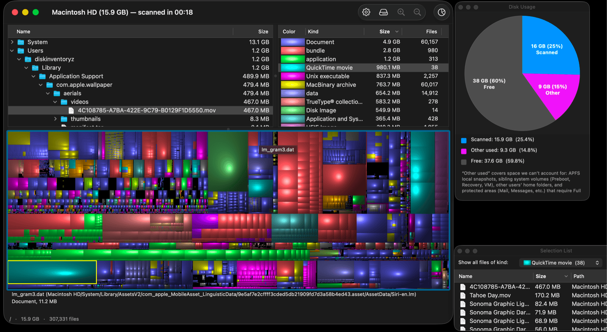
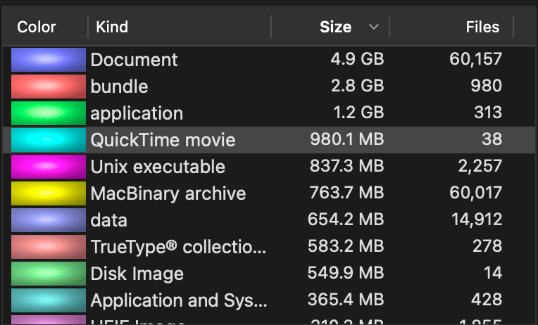
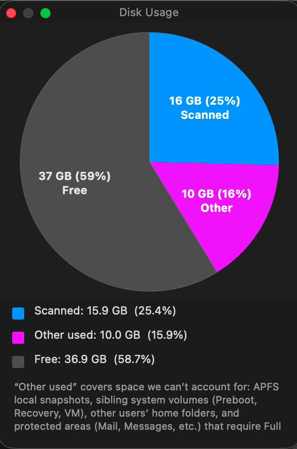
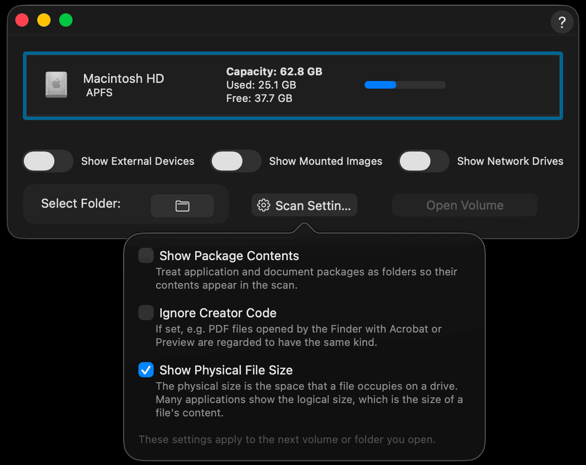
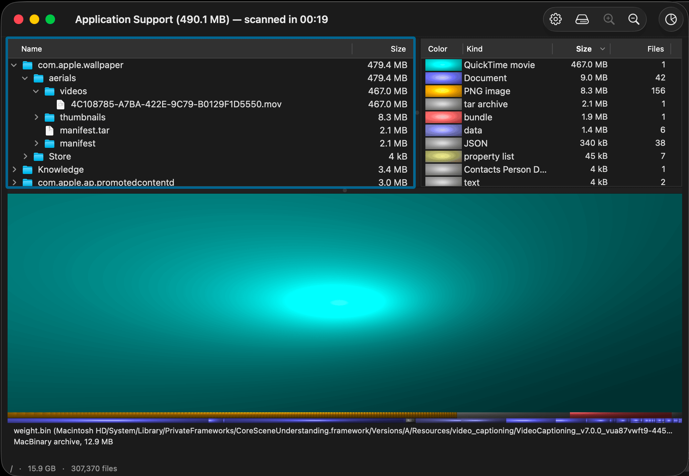

# Disk Inventory Z

**See where your disk space actually went.** Disk Inventory Z is a native
macOS app that scans a drive or folder and draws every file as a colored
block in a [treemap](https://en.wikipedia.org/wiki/Treemapping) — the bigger
the file, the bigger the block. Spotting the handful of giant files eating
your disk takes seconds.

It's a modern, updated fork of the classic
[Disk Inventory X](https://gitlab.com/tderlien/disk-inventory-x) by
Tjark Derlien, but rebuilt to fully support macOS 26 Tahoe.

This app is similar to [WinDirStat](https://windirstat.net/), [kDirStat](https://kdirstat.sourceforge.net/)/ [qdirstat](https://github.com/shundhammer/qdirstat) but for macOS.

## Download

Grab the latest signed, notarized build from the
[**Releases**](https://github.com/danifunker/disk-inventory-z/releases) page.

1. Download the `.dmg` from the newest release.
2. Open it and drag **Disk Inventory Z** to your Applications folder.
3. Launch it. The first time you scan certain locations, macOS may ask you
   to grant **Full Disk Access** — the app will point you to the right pane
   in System Settings.

Requires macOS 13 (Ventura) or later.

## Features

- **Treemap view** — every file and folder drawn to scale, colored by kind,
  so the space hogs jump out visually.
- **Kind statistics** — a sortable breakdown of how much space each file
  type (documents, disk images, videos, …) is using, with matching colors
  across the treemap and the list.
- **Disk usage pie** — for a whole-volume scan, a quick scanned / other /
  free overview of the drive.
- **Drill in and out** — zoom into any folder to focus the treemap, then
  zoom back out.
- **Acts on files** — reveal in Finder, open, or move to Trash straight from
  the app.
- **Scan settings** — choose before you scan whether to look inside
  packages, use physical vs. logical sizes, and how to treat creator codes.
- **Fast scans** — folders are walked on a background engine so the window
  stays responsive, with live progress and the ability to cancel.

## Screenshots

<!--
  Screenshots live in docs/screenshots/. Replace the images below once you've
  captured them (see docs/screenshots/README.md for the recommended shot list
  and capture tips). Until then these links will show as broken on GitHub.
-->

  

|  |  |
| --- | --- |
|  |  |
|  |  |

## Privacy

Disk Inventory Z only reads file **sizes and metadata** — it never reads the
contents of your files, and nothing leaves your Mac. When a scan includes a
macOS privacy-protected location, the app checks access up front and skips
the warning entirely when access is already granted.

## Building from source

Developers: see [BUILD.md](BUILD.md) for build instructions, the project
layout, the release process, and the fork's lineage.

## Use of AI
AI was used to help update this fork. That said, a lot of testing has been done to ensure it works correctly. If you encounter any issues, please submit a github issue.

## License

GPL v3 — same as the upstream project. See [COPYING](COPYING).

Original copyright © Tjark Derlien. Fork maintained by Dani Sarfati.
